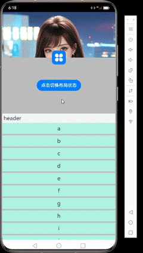
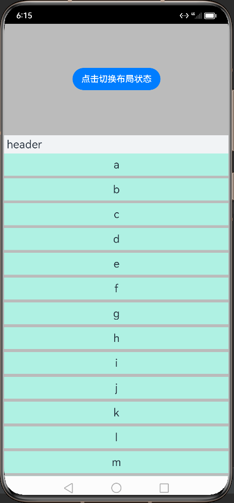

# HarmonyOSSlidingUpPanel

### 介绍
SlidingUpPanel是HarmonyOS平台的一个可以上下拖动的面板布局,且可以在上中下位置滑动切换状态并自动吸附，可以利用它完成复杂抽屉式界面


### 使用说明

#### 定义组件的基本参数
```typescript
 //滑动面板的初始化参数 SlidingUpPanelConfigurator
    this.configurator = new SlidingUpPanelConfigurator();
    this.configurator.setPanelPositionYWeightArray([0,0.2,0.8])
    this.slidingUpPanelState = this.configurator.initState;
```
#### 组件使用
```typescript
SlidingUpPanel({isMove:this.isMove,configurator:this.configurator,controller:this.slidingUpPanelController,
       bottomLayout:()=>{
         //自定义底层布局   @Builder
      this.bottomLayout();
     },upLayout:()=>{
         //自定义上层布局   @Builder
         this.upLayout();
     },stateCallback:(state:SlidingUpPanelState)=>{
         //滑动状态回调
         this.slidingUpPanelState = state;
     },slidOffsetYCallback:(offsetY:number)=>{
         //滑动位移数回调
         Logger.debug(" this.slidOffsetY:"+ this.slidOffsetY);
        this.slidOffsetY = offsetY;
     }
     })
```

#### 状态属性说明
```typescript
  this.configurator.setPanelPositionYWeightArray([0,0.2,0.8])   //该数组对应的权重如下
```
| 0                              |              0.2               |                            0.8 |
|:-------------------------------|:------------------------------:|-------------------------------:|
|  |  |  |


#### Demo
https://gitee.com/chensibei/HarmonyOSSlidingUpPanel/blob/master/entry/src/main/ets/pages/Index.ets

联系作者: sibeichen@petalmail.com

#### 开源协议
本项目基于 Apache License 2.0